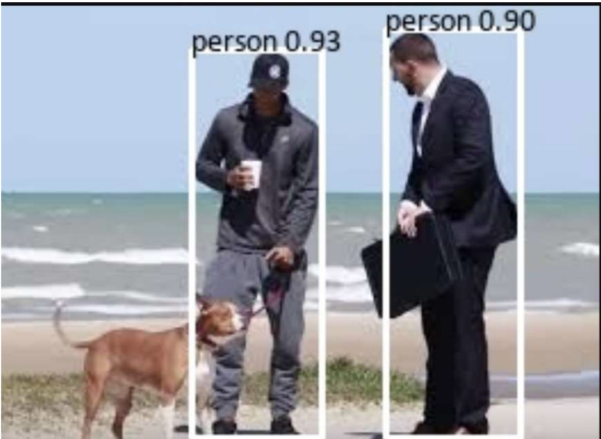
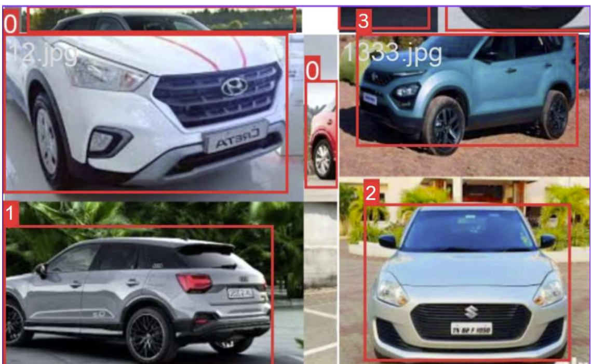

# 🧠 Object Detection using YOLOv8

A computer vision project that leverages the power of **YOLOv8 (You Only Look Once)** for real-time object detection on images. This project demonstrates the use of a **pretrained model** to detect persons and a **custom-trained model** to detect various **car brands** with significant accuracy.

---

## 🚀 Project Highlights

* ✅ Used **YOLOv8 pretrained model** for detecting people in images.
* 🚗 Trained a **custom YOLOv8 model** on a dataset of car brand logos (e.g., BMW, Audi, Toyota).
* 📊 Achieved an accuracy of **\~68.42%** in the car brand detection task.
* 🌐 Built a **basic frontend interface** for uploading images and visualizing detection results.
* 📁 Organized code for training, inference, and model evaluation.

---

## 🛠️ Tech Stack

* **Framework**: [Ultralytics YOLOv8](https://github.com/ultralytics/ultralytics)
* **Language**: Python
* **Libraries**: OpenCV, PyTorch, Ultralytics, Matplotlib
* **Interface (optional)**: HTML, CSS, JavaScript (for frontend)

---

## 📂 Project Structure

```
Object-Detection-using-YOLOv8/
├── dataset/               # Custom training dataset
├── runs/                  # YOLOv8 output files
├── yolov8-custom/         # Custom-trained weights and config
├── test_images/           # Images used for testing
├── yolov8_inference.py    # Script for inference using YOLOv8
├── yolov8_train.py        # Script to train on custom data
├── requirements.txt
└── README.md
```

---

## ⚙️ Getting Started

### 1. Clone the Repository

```bash
git clone https://github.com/AnkitArjunag/Object-Detection-using-YOLOv8.git
cd Object-Detection-using-YOLOv8
```

### 2. Install Dependencies

```bash
pip install -r requirements.txt
```

Or manually:

```bash
pip install ultralytics opencv-python matplotlib
```

### 3. Run Inference with Pretrained Model

```python
from ultralytics import YOLO

model = YOLO("yolov8n.pt")  # Can also use yolov8s.pt, yolov8m.pt, etc.
results = model("test_images/sample.jpg", show=True)
```

### 4. Train a Custom Model

```bash
yolo task=detect mode=train model=yolov8n.pt data=car_dataset.yaml epochs=50 imgsz=640
```

---

## 🖼️ Sample Output

```markdown

```

```markdown

```

---

## 📊 Results

| Task                | Model         | Accuracy |
| ------------------- | ------------- | -------- |
| Person Detection    | YOLOv8n       | High     |
| Car Brand Detection | Custom YOLOv8 | \~68.42% |

---

## 🙋‍♂️ Author

* Ankit Arjunagi

---

## 📄 License

This project is licensed under the **MIT License** – see the [LICENSE](LICENSE) file for details.

